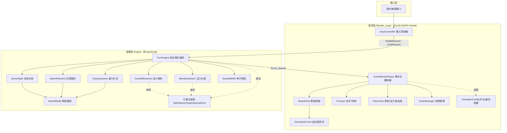
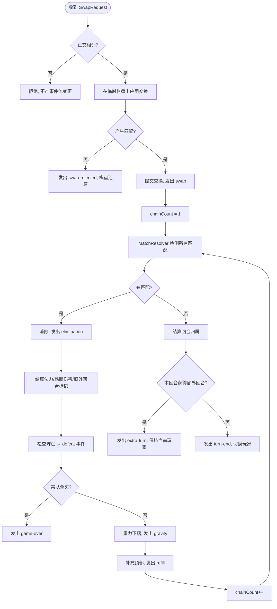

# 设计文档

## 概述

本设计描述网页三消战斗游戏核心引擎的技术实现方案。系统由两个严格分离的层组成：

- **逻辑层（Engine）**：纯 TypeScript，无任何渲染/计时/浏览器依赖。负责棋盘状态、规则解析，并把每个回合解析为一串确定性的、带类型的**事件流（Event_Stream）**。完全可单元测试。
- **表现层（Render_Layer）**：基于 PixiJS + GSAP。消费事件流，把每个事件翻译成动画、粒子、音效与屏幕反馈。是唯一执行动画与计时的层。

这种分离是整个设计的基石（对应需求 17）：规则正确性由逻辑层的单元测试与属性测试保证；手感与表现可独立打磨而不触碰规则；后续 RPG 系统（技能内容、buff、特殊宝石）通过预留接口扩展而无需重写核心。

### 技术栈

| 关注点 | 选型 | 理由 |
|--------|------|------|
| 语言 | TypeScript（strict 模式） | 类型安全，逻辑层可严格约束 |
| 渲染 | PixiJS（WebGL） | 2D 批量渲染性能强，粒子/缓动可控，打包轻 |
| 补间动画 | GSAP | 弹性/过冲缓动质量高，时间线编排能力强 |
| 音频 | Howler.js | 音量分层、音高调节、自动播放策略处理 |
| 构建 | Vite | 快速开发、产出纯静态包、base 路径可配 |
| 测试 | Vitest + fast-check | 单元测试 + 基于属性的测试（PBT） |
| 部署 | GitHub Pages / Cloudflare Pages | 纯静态托管，无后端 |

### 设计目标与约束映射

- 确定性（需求 3.4、17.3）：逻辑层所有随机性经由可注入的种子化 RNG，不直接调用 `Math.random`。
- 纯净性（需求 17.1、17.2）：Engine 包不 import 任何 Pixi/GSAP/DOM 符号，由构建配置与 lint 规则强制。
- 可扩展（需求 20）：技能效果、状态、目标选择、特殊宝石均通过接口/注册表实现，核心不内联具体内容。
- 可测试（需求 17.5）：回合解析为纯函数式的"状态 + 输入 → 新状态 + 事件流"。

## 架构

### 分层架构图



### 关键架构决策

1. **单向数据流**：输入 → 引擎解析 → 事件流 → 表现层播放。表现层从不直接修改逻辑层状态，只读取事件。
2. **事件流是唯一契约**：表现层只依赖事件流的结构，不依赖引擎内部实现。每个事件自带足够数据（需求 18.5），表现层无需回查引擎状态即可动画化。
3. **解析与播放异步解耦**：引擎在一帧内同步完成整个回合解析（含所有连锁），产出完整事件流；表现层随后按时间线逐步播放。这保证"动画可快进/跳过而不影响结算结果"（需求 25）。
4. **扩展点集中注册**：技能、状态、目标策略、特殊宝石生成都通过注册表注入，核心引擎只调用接口。

## 逻辑层数据模型

### 基础类型

```typescript
/** 基础颜色（六系元素） */
enum BaseColor { Red, Green, Blue, Yellow, Purple, Brown }

/** 元素映射（需求 2.2） */
const COLOR_ELEMENT: Record<BaseColor, string> = {
  [BaseColor.Red]: 'Fire',   [BaseColor.Green]: 'Wood',
  [BaseColor.Blue]: 'Water', [BaseColor.Yellow]: 'Wind',
  [BaseColor.Purple]: 'Magic', [BaseColor.Brown]: 'Earth',
};

/**
 * 宝石类型采用可辨识联合（discriminated union），
 * 而非固定枚举，以满足需求 2.5 / 20.1 的可扩展性。
 */
type GemType =
  | { kind: 'color'; color: BaseColor }
  | { kind: 'skull'; variant: 'normal' }       // 后续可加 'giant'
  | { kind: 'special'; spec: SpecialGemSpec };  // 本阶段预留，不生成

interface Gem {
  id: number;          // 稳定唯一 id，供表现层追踪同一宝石的移动
  type: GemType;
}

/** 坐标：行、列，从 0 开始 */
interface CellPos { row: number; col: number; }
```

> **设计说明**：`Gem.id` 是手感的关键。重力下落时表现层需要知道"哪个精灵从 A 移到 B"，靠稳定 id 而非坐标来追踪，避免下落动画错乱。

### 棋盘模型

```typescript
class BoardModel {
  static readonly ROWS = 8;
  static readonly COLS = 8;
  private grid: (Gem | null)[][];  // [row][col]

  get(pos: CellPos): Gem | null;
  set(pos: CellPos, gem: Gem | null): void;
  swap(a: CellPos, b: CellPos): void;
  isAdjacent(a: CellPos, b: CellPos): boolean;  // 正交相邻判定
  clone(): BoardModel;  // 用于规则推演（如检测合法交换）不污染真实状态
}
```

### 角色与队伍

```typescript
/** 法力需求：每种颜色一个所需阈值（需求 10.2） */
type ManaRequirement = Partial<Record<BaseColor, number>>;
/** 法力池：每种颜色当前累积值（需求 10.1, 10.3） */
type ManaPool = Partial<Record<BaseColor, number>>;

interface Character {
  id: number;
  name: string;
  maxHp: number;
  hp: number;            // 当前生命（需求 13.4 初始化为 maxHp）
  attack: number;
  armor: number;
  colors: BaseColor[];   // 关联颜色，可多个（需求 13.2）
  manaRequirement: ManaRequirement;
  manaPool: ManaPool;
  skillId: string;       // 指向技能注册表（需求 16.4, 20.2）
  statuses: StatusEffect[];  // 预留，本阶段为空（需求 13.5, 20.3）
  defeated: boolean;
}

interface Team {
  player: PlayerSide;
  characters: Character[];  // 长度 4，索引 0=顶 3=底
}

enum PlayerSide { Left, Right }
```

### 全局状态

```typescript
enum MatchState { AwaitingInput, Resolving, GameOver }

interface GameState {
  board: BoardModel;
  teams: Record<PlayerSide, Team>;
  activePlayer: PlayerSide;
  state: MatchState;
  chainCount: number;     // 当前回合内连锁计数（需求 8.7）
  winner: PlayerSide | null;
}
```

## 事件系统

事件流是逻辑层与表现层之间唯一的契约（需求 18）。所有事件实现统一基类型，按发生顺序排列。

```typescript
type GameEvent =
  | SwapEvent | SwapRejectedEvent
  | EliminationEvent | ManaGainEvent | SkullDamageEvent
  | SkillCastEvent | DefeatEvent
  | GravityEvent | RefillEvent
  | SpecialGemHookEvent
  | ExtraTurnEvent | TurnEndEvent | GameOverEvent;

interface SwapEvent { type: 'swap'; a: CellPos; b: CellPos; }
interface SwapRejectedEvent { type: 'swap-rejected'; a: CellPos; b: CellPos; }

interface EliminationEvent {
  type: 'elimination';
  chainCount: number;                 // 需求 8.8
  cells: { pos: CellPos; gemId: number; gemType: GemType }[];
  matchShape: 'line3' | 'line4plus' | 'L' | 'T';  // 需求 7, 19.11
}

interface ManaGainEvent {
  type: 'mana-gain';
  color: BaseColor; amount: number;
  characterId: number; player: PlayerSide;   // 需求 11.3
}

interface SkullDamageEvent {
  type: 'skull-damage';
  attackerId: number;                 // 队首存活攻击者（需求 14.5）
  targetId: number; damage: number;
  resultingHp: number; resultingArmor: number;  // 需求 14.4
}

interface GravityEvent {
  type: 'gravity';
  moves: { gemId: number; from: CellPos; to: CellPos }[];  // 需求 8.3
}
interface RefillEvent {
  type: 'refill';
  spawns: { gemId: number; to: CellPos; gemType: GemType }[];  // 需求 8.4
}

interface SkillCastEvent { type: 'skill-cast'; characterId: number; skillId: string; }
interface DefeatEvent { type: 'defeat'; characterId: number; }
interface ExtraTurnEvent { type: 'extra-turn'; player: PlayerSide; }
interface TurnEndEvent { type: 'turn-end'; nextPlayer: PlayerSide; }
interface GameOverEvent { type: 'game-over'; winner: PlayerSide; }
interface SpecialGemHookEvent {  // 需求 7.4, 7.5 —— 本阶段仅标记，不生成
  type: 'special-gem-hook'; pos: CellPos; reason: 'match5' | 'L' | 'T';
}
```

### 事件排序保证

引擎产出的事件流严格遵守以下顺序（需求 18.2-18.4）：

```
[swap | swap-rejected]
  └─ 每个连锁迭代（chainCount 升序）:
       elimination[]            （本次迭代所有消除）
         ├─ mana-gain[]         （颜色匹配产生）
         ├─ skull-damage[]      （骷髅匹配产生）
         ├─ special-gem-hook[]  （若触发）
         └─ defeat[]            （若有角色阵亡）
       gravity                  （下落）
       refill                   （补充）
  └─ ... 直到无新匹配
[extra-turn | turn-end]
[game-over]                     （若触发胜利）
```

## 核心算法

### 回合解析主循环

`TurnEngine.resolveTurn` 是引擎核心。它接收一个交换请求，同步完成全部连锁解析，产出完整事件流。这是一个纯函数式流程——输入相同则输出相同（需求 17.3）。



### 匹配检测算法（MatchResolver）

```
1. 水平扫描：对每行，找出连续 ≥3 同色（或同为骷髅）的区段。
2. 垂直扫描：对每列，同样找出连续 ≥3 区段。
3. 合并：将共享格子的水平段与垂直段合并为同一消除组（需求 6.3）。
   - 用并查集 (Union-Find) 或基于格子集合的连通合并。
4. 形状判定（需求 7）：
   - 仅单方向且长度==3 → 'line3'
   - 仅单方向且长度>=4 → 'line4plus'
   - 水平段与垂直段在某格交汇 → 'L' 或 'T'（按交汇点位置区分）
5. 额外回合：line4plus / L / T 任一出现 → 标记本回合 grantedExtraTurn=true（需求 7.2, 7.3）。
```

**复杂度**：8x8 棋盘，单次检测 O(行×列)=O(64)，连锁次数有限，性能无忧。

### 重力与补充（GravitySystem）

```
重力（需求 8.1, 8.3）:
  对每一列 col:
    收集该列从底到顶所有非空 Gem，保序。
    从最底行开始重新放置这些 Gem。
    记录每个 Gem 的 from→to（仅当位置变化）生成 GravityEvent.moves。

补充（需求 8.2, 8.4）:
  对每一列顶部剩余空格:
    用种子化 RNG 生成新 Gem（分配新 id）。
    生成 RefillEvent.spawns。
  注意：补充不刻意避免连锁（需求 3.3）——下落/补充后再次进入匹配检测，
        允许自然产生 Cascade。仅初始棋盘生成需保证无预成匹配。
```

### 初始棋盘生成（需求 3）

```
重复:
  用种子化 RNG 填满 8x8 颜色宝石。
  若存在任何匹配 → 对冲突格子重抽，直到无匹配（需求 3.1）。
  检测是否存在至少一个合法交换（在 clone 上试遍所有相邻交换，需求 3.2）。
直到 同时满足"无预成匹配"且"存在合法交换"。
```

### 法力分配算法（ManaDistributor）—— 从上到下顺序吸收

这是本游戏区别于标准三消的核心机制（需求 12）。

```
对单次产生的 (color, amount)（amount = 该匹配宝石数, 需求 11.1）:
  remaining = amount
  for 角色 in 当前玩家队伍, 索引 0→3:        # 从上到下（需求 12.1）
      if 角色.defeated: continue              # 跳过阵亡（需求 12.3）
      if color not in 角色.manaRequirement: continue   # 跳过不吃此色（需求 12.2）
      need = 角色.manaRequirement[color] - 角色.manaPool[color]
      give = min(remaining, need)             # 不超过上限（需求 10.4）
      角色.manaPool[color] += give
      remaining -= give
      发出 ManaGainEvent(color, give, 角色.id)  # 需求 11.3
      if remaining == 0: break
  # 溢出且无人可接 → 丢弃（需求 12.5），remaining 直接舍去
```

> **关键点**：一个角色可同时需要多种颜色（如同时吃红和蓝），各颜色在 `manaPool` 中独立累积、独立判满。某色填满后该色的溢出流向下一个吃此色的角色，但不影响该角色其它颜色的继续累积。

### 骷髅伤害（CombatResolver）

```
对一次骷髅匹配 (N 个骷髅, 需求 14.1):
  attacker = 当前玩家队伍中从上到下第一个未阵亡角色（队首，需求 14.1/14.3）
  damage = attacker.attack × N
    —— 攻击者固定为队首存活角色；公式封装为可替换策略，便于后期改为武器/加成体系。
  target = 敌方队伍中从上到下第一个未阵亡角色（需求 14.2，经 TargetSelector 接口）
    —— 敌我双方均采用同一"队首存活角色"规则确定攻击者与受击者（需求 14.3）。
  先扣护甲后扣血（需求 14.4）:
     absorbed = min(target.armor, damage)
     target.armor -= absorbed
     target.hp   -= (damage - absorbed)
  发出 SkullDamageEvent(attacker, target, damage, target.hp, target.armor)  # 需求 14.5
  if target.hp <= 0: 标记 defeated, 发出 DefeatEvent（需求 15.1）
```

### 扩展点接口（需求 20）

```typescript
interface SkillEffect {            // 需求 20.2 —— 本阶段无实现
  apply(state: GameState, casterId: number): GameEvent[];
}
interface StatusEffect {           // 需求 20.3 —— 本阶段空壳
  id: string;
  onTurnStart?(state: GameState, charId: number): GameEvent[];
}
interface TargetSelector {         // 需求 20.4 —— 默认实现：第一个存活敌人
  select(state: GameState, attacker: PlayerSide): number;
}
interface SpecialGemSpec {         // 需求 20.1 —— 已定义未启用
  kind: 'lightning' | 'bomb' | 'giantSkull' | string;
}
// 集中注册表
class ExtensionRegistry {
  skills = new Map<string, SkillEffect>();
  statuses = new Map<string, StatusEffect>();
  targetSelector: TargetSelector = new DefaultFrontTargetSelector();
}
```

## 表现层架构

### 事件流播放器（EventStreamPlayer）

播放器是表现层核心。它把引擎产出的事件流编排成一条 GSAP 时间线（timeline），按因果顺序逐段播放，并将动画速度、跳过等控制集中在此（需求 23、25）。

```typescript
class EventStreamPlayer {
  private timeline: gsap.core.Timeline;
  private speedMultiplier = 1;   // 需求 25.1 全局倍率

  async play(events: GameEvent[]): Promise<void> {
    // 按事件类型把动画片段 append 进 timeline，
    // 同一连锁迭代内的消除可并行，迭代之间留间隔（需求 23.3）
    for (const ev of events) this.appendSegment(ev);
    this.timeline.timeScale(this.speedMultiplier);
    await this.timeline.play();   // 播完后置 AwaitingInput
  }

  skip(): void {                  // 需求 25.2：立即跳到终态
    this.timeline.progress(1).kill();
    this.applyFinalState();       // 棋盘/血条/法力条直接到事件流终态
  }
}
```

> **解耦保证**：引擎已经在播放前算出了全部结果。跳过只是快进动画，不改变任何结算（需求 25.3、25.4）。

### 棋盘视图与宝石精灵池

```typescript
class GemSpritePool {            // 需求 24.3 对象池
  acquire(gemId: number, type: GemType): GemSprite;
  release(sprite: GemSprite): void;  // 消除后回收而非销毁
}
```

- `GemSprite` 按 `gemId` 索引，与逻辑层宝石一一对应，保证下落追踪正确。
- 消除时播放"放大→闪白→碎裂粒子"后回收（需求 19.3）。
- 下落用 GSAP `back.out` 过冲缓动 + 按列错峰延迟（需求 19.4、23.4）。

### 动画配置（AnimationConfig）

集中管理所有时长与缓动（需求 23.1），是统一调校手感的唯一入口：

```typescript
const AnimConfig = {
  swap:        { duration: 0.18, ease: 'power2.out' },
  swapReject:  { duration: 0.30, ease: 'back.inOut(2)' },
  eliminate:   { duration: 0.22, scaleUp: 1.25 },
  gravity:     { perCellDuration: 0.07, ease: 'back.out(1.4)', columnStagger: 0.03 },
  refill:      { ease: 'back.out(1.2)' },
  manaFill:    { duration: 0.25 },
  damage:      { shake: 0.25, flash: 0.15 },
  chainGap:    0.08,           // 连锁迭代间隔（需求 23.3）
  globalScale: 1,              // 速度倍率（需求 25.1）
};
```

### 输入控制器（InputController）

实现需求 22 的跟手与判定：

- `pointerdown` 即记录起点并允许该宝石跟随移动（≤1 帧响应，需求 22.1、22.2）。
- 拖动中实时更新精灵位置，并高亮预交换方向的相邻格。
- `pointerup` 时按位移阈值（约半格）判定：超阈→发交换请求；否则平滑归位（需求 22.3）。
- 两步点选：首点高亮，二点相邻则交换，非相邻则转移选中（需求 22.4）。

### 音频管理（AudioManager）

- 基于 Howler，分主/音效/音乐三条音量总线（需求 26.4）。
- 消除音随 `chainCount` 升 `rate`（音高）实现连锁升调（需求 26.2）。
- 首次用户交互后初始化音频上下文，规避自动播放限制（需求 26.5）。

## 性能设计

| 措施 | 对应需求 |
|------|----------|
| 宝石/粒子对象池，避免高频创建销毁 | 24.3 |
| 粒子总数上限，超限优先核心反馈 | 24.4 |
| GSAP 基于 delta-time 推进，帧率无关 | 24.5 |
| PixiJS WebGL 批量渲染 + 雪碧图减少 draw call | 24.1 |
| 移动端可降粒子密度档位 | 24.2 |

## 错误处理

- **非法输入**：非相邻交换、解析中输入、游戏结束后输入——引擎静默拒绝并保持状态不变（需求 4.2、4.3、9.4）。表现层对非法交换播放回弹（需求 5.3）。
- **事件流断言**：开发模式下，引擎可对产出事件流做内部一致性断言（如棋盘填满、事件顺序），生产构建剥离。
- **音频失败**：音频初始化失败时降级为静音，不阻塞游戏（需求 26.5）。
- **资源加载失败**：占位资源加载失败时用纯色矩形兜底，保证可玩。

## 构建与部署（需求 21）

- Vite 产出纯静态 `dist/`（HTML+JS+资源），无服务端运行时。
- `vite.config.ts` 的 `base` 设为可配置，适配 GitHub Pages 子路径（需求 21.3）。
- 资源经雪碧图打包；美术资源以占位图起步，路径与加载逻辑稳定，替换最终美术不动引擎代码（需求 21.4）。
- 部署：`dist/` 直接推送到 GitHub Pages 分支或 Cloudflare Pages。

## 测试策略

测试是"商用级可靠"的保障。逻辑层因其纯净性可被充分测试。

### 单元测试（Vitest）

- 匹配检测：各种 3/4/5 连、L/T 形、共享格合并。
- 重力补充：列内下落正确性、空格填补。
- 法力分配：从上到下顺序、跳过阵亡/不吃此色、溢出流向下一角色、无人可接则丢弃（需求 12 全条）。
- 骷髅伤害：护甲优先、阵亡判定、目标选择。
- 回合经济：额外回合保留、多次额外回合只保留一次、回合切换。
- 胜负：全灭判定、游戏结束后拒绝输入。

### 基于属性的测试（PBT，fast-check）—— 对应正确性属性

我们为引擎定义可执行的**正确性属性**，用随机生成的棋盘与操作序列验证：

1. **棋盘满格不变量**：每次回合解析结束、状态回到等待输入时，棋盘 64 格全部非空（需求 1.4）。
2. **确定性**：相同种子 + 相同操作序列 → 相同最终状态与相同事件流（需求 17.3）。
3. **法力守恒/上限**：任一角色任一颜色法力 ∈ [0, 该色需求值]，永不越界（需求 10.4）。
4. **法力分配总量守恒**：单次产出的法力，要么被吸收要么被显式丢弃，分配给各角色之和 ≤ 产出量。
5. **事件流顺序合法**：产出的事件流恒满足"消除前于法力/伤害、重力前于补充、终结事件在末尾"的排序约束（需求 18.2-18.4）。
6. **生命值单调与非负终态**：骷髅伤害只减不增（无治疗时），阵亡角色不再被分配法力或选为目标（需求 15.2）。
7. **HP 边界**：角色 hp 在任何时刻不被错误地置为正以外的越界值；阵亡判定恰在 hp≤0 触发。

### 表现层测试

- 表现层因依赖渲染/计时，以手动与可视化回归为主。
- 关键可测点：`EventStreamPlayer.skip()` 后的终态与事件流终态一致（需求 25.4）——可不渲染、纯逻辑断言。

## 项目结构

```
demo/
├─ index.html
├─ vite.config.ts
├─ package.json
├─ src/
│  ├─ engine/                 # 纯逻辑层（禁止 import pixi/gsap/dom）
│  │  ├─ types.ts             # GemType, Character, GameState ...
│  │  ├─ BoardModel.ts
│  │  ├─ MatchResolver.ts
│  │  ├─ GravitySystem.ts
│  │  ├─ ManaDistributor.ts
│  │  ├─ CombatResolver.ts
│  │  ├─ TurnEngine.ts        # resolveTurn 主循环
│  │  ├─ events.ts            # GameEvent 联合类型
│  │  ├─ rng.ts               # SeededRNG
│  │  ├─ boardGen.ts          # 初始棋盘生成
│  │  └─ registry.ts          # 扩展点注册表
│  ├─ render/                 # 表现层（PixiJS+GSAP+Howler）
│  │  ├─ App.ts
│  │  ├─ EventStreamPlayer.ts
│  │  ├─ BoardView.ts
│  │  ├─ GemSprite.ts
│  │  ├─ GemSpritePool.ts
│  │  ├─ FXLayer.ts
│  │  ├─ TeamView.ts
│  │  ├─ InputController.ts
│  │  ├─ AudioManager.ts
│  │  └─ AnimationConfig.ts
│  └─ main.ts                 # 组装引擎与表现层
├─ tests/
│  ├─ unit/
│  └─ property/               # fast-check 属性测试
└─ assets/                    # 占位美术/音效
```
