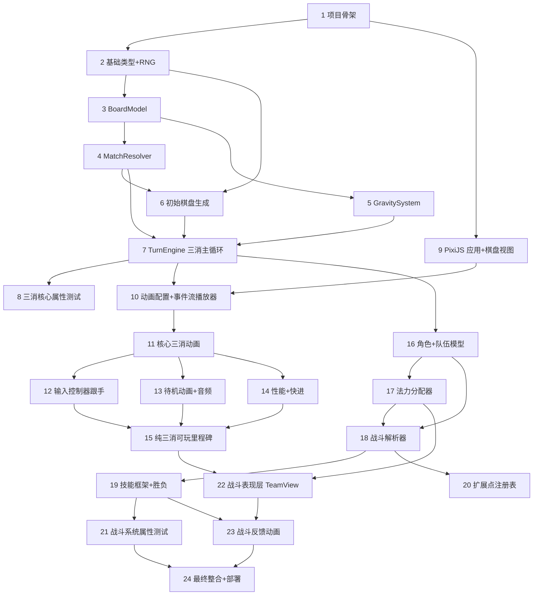

# Implementation Plan: 三消战斗核心

## Overview

> 实施策略：**三消核心与手感优先**。第 1-15 任务构成可玩、手感成熟的纯三消主线（棋盘、交换、匹配、连锁、重力、完整手感与性能）。第 16-24 任务在稳固的三消基础上叠加战斗系统（法力、骷髅、角色、胜负）。每个任务完成后即可运行验证，逻辑层任务均要求随任务编写测试。

## Tasks

### 阶段一：项目骨架与纯逻辑内核

- [x] 1. 初始化项目与工具链
  - 用 Vite + TypeScript（strict）初始化项目，建立 `src/engine`、`src/render`、`tests/unit`、`tests/property`、`assets` 目录结构
  - 配置 Vitest 与 fast-check；配置 ESLint 规则禁止 `src/engine` import 任何 pixi/gsap/dom 符号（强制逻辑层纯净）
  - 配置 `vite.config.ts` 的 `base` 为可配置项，验证 `npm run build` 产出纯静态 `dist/`
  - _需求: 17.2, 21.1, 21.2, 21.3_

- [x] 2. 实现基础类型与种子化随机
  - 定义 `BaseColor` 枚举、`COLOR_ELEMENT` 映射、`GemType` 可辨识联合、`Gem`、`CellPos`
  - 实现 `SeededRNG`（确定性伪随机，不使用 `Math.random`），并编写测试验证同种子产出同序列
  - _需求: 2.1, 2.2, 2.3, 2.5, 3.4_

- [x] 3. 实现棋盘模型 BoardModel
  - 实现 8x8 网格存取、`swap`、`isAdjacent`（正交相邻）、`clone`
  - 编写单元测试：尺寸、坐标边界、相邻判定、克隆隔离性
  - _需求: 1.1, 1.2, 1.3_

### 阶段二：三消核心规则（逻辑层）

- [x] 4. 实现匹配检测 MatchResolver
- [x] 4.1 实现水平/垂直连续段扫描与共享格合并
  - 扫描每行每列找出 ≥3 连续同色（及骷髅）区段；用并查集合并共享格子为单一消除组
  - 编写单元测试：横向3/4/5连、纵向连、交叉共享格合并为一组
  - _需求: 6.1, 6.2, 6.3, 6.4_
- [x] 4.2 实现匹配形状判定
  - 区分 `line3` / `line4plus` / `L` / `T`，并据此标记是否授予额外回合
  - 编写单元测试覆盖各形状及额外回合标记
  - _需求: 7.1, 7.2, 7.3_

- [x] 5. 实现重力与补充 GravitySystem
  - 实现列内重力下落（保序填入最低可用格）与顶部补充（种子化 RNG 生成新 Gem 并分配新 id）
  - 产出 `GravityEvent.moves`（from→to）与 `RefillEvent.spawns`（to + gemType）
  - 编写单元测试：单列/多列下落正确性、空格全部填补、新 id 唯一
  - _需求: 8.1, 8.2, 8.3, 8.4_

- [x] 6. 实现初始棋盘生成 boardGen
  - 生成无预成匹配且至少存在一个合法交换的初始棋盘（在 clone 上试遍相邻交换检测合法性）
  - 编写单元测试：生成结果无匹配、存在合法交换、固定种子可复现
  - _需求: 3.1, 3.2, 3.4_

- [x] 7. 实现事件类型与回合解析主循环 TurnEngine（三消部分）
- [x] 7.1 定义事件类型与 GameState
  - 实现 `events.ts` 全部 `GameEvent` 联合类型与 `GameState`、`MatchState`
  - _需求: 18.1, 18.5_
- [x] 7.2 实现交换合法性判定与提交/回弹
  - 正交相邻校验；在临时棋盘试交换检测匹配；合法则提交并发 `swap`，非法则发 `swap-rejected` 且棋盘不变；解析中/游戏结束拒绝输入
  - 编写单元测试覆盖合法/非法/非相邻/状态拒绝
  - _需求: 4.1, 4.2, 4.3, 5.1, 5.2, 9.4_
- [x] 7.3 实现连锁主循环
  - 编排"消除→重力→补充→再检测"循环直至无新匹配；每次迭代递增 `chainCount` 并写入消除事件；保证事件流排序约束
  - 编写单元测试：单次交换触发多级连锁、chainCount 递增正确、事件顺序合法
  - _需求: 8.5, 8.6, 8.7, 8.8, 18.2, 18.3, 18.4_
- [x] 7.4 实现回合经济（三消层面）
  - 依据额外回合标记决定保留/切换玩家；多次额外回合只保留一次；发 `extra-turn`/`turn-end`
  - 编写单元测试覆盖保留、切换、多次额外回合归一
  - _需求: 7.1, 9.1, 9.2, 9.3_

- [ ] 8. 编写三消核心的属性测试（PBT）
  - 棋盘满格不变量：解析结束回到等待输入时 64 格全非空
  - 确定性：相同种子+相同操作序列 → 相同终态与相同事件流
  - 事件流顺序合法性：随机操作下事件流恒满足排序约束
  - _需求: 1.4, 17.3, 18.2, 18.3, 18.4_

### 阶段三：三消表现层与成熟手感（重点）

- [ ] 9. 搭建 PixiJS 应用与棋盘视图
  - 初始化 Pixi 应用、自适应画布；实现 `BoardView` 网格布局与坐标↔像素换算
  - 实现 `GemSprite` 与 `GemSpritePool`（对象池，消除回收而非销毁）
  - 实现占位宝石美术（纯色/几何，资源失败时矩形兜底），加载路径稳定可替换
  - _需求: 21.4, 24.3, 19.3_

- [ ] 10. 实现动画配置与事件流播放器
- [ ] 10.1 实现 AnimationConfig 集中配置
  - 集中定义各动画时长/缓动/连锁间隔/全局速度倍率，作为统一调校手感的唯一入口
  - _需求: 23.1, 25.1_
- [ ] 10.2 实现 EventStreamPlayer 时间线编排
  - 将事件流按因果顺序编排为 GSAP 时间线；同迭代消除并行、迭代间留间隔；播完置等待输入
  - _需求: 23.3, 23.5, 18.2_

- [ ] 11. 实现核心三消动画（手感主体）
- [ ] 11.1 交换与回弹动画
  - 合法交换跟手移动（缓出+轻微过冲）；非法交换相向半格后弹性回弹归位
  - _需求: 19.1, 19.2, 5.3_
- [ ] 11.2 消除动画
  - 放大→闪白高光→按宝石颜色着色的碎裂粒子爆裂；4/5/L/T 消播放强度更高的强调特效
  - _需求: 19.3, 19.11_
- [ ] 11.3 重力下落与补充动画
  - `back.out` 过冲回弹缓动 + 按列错峰延迟；新宝石从顶部上方落入
  - _需求: 19.4, 23.4_
- [ ] 11.4 连锁反馈
  - 连锁计数 >1 时：升调连锁音效、随连锁递增的屏幕震动、飘动并淡出的连击数指示
  - _需求: 19.5_

- [ ] 12. 实现输入控制器 InputController（跟手）
  - `pointerdown` ≤1 帧内开始跟手；拖动实时跟随并高亮预交换方向相邻格；`pointerup` 按位移阈值判定交换或平滑归位
  - 两步点选：首点高亮、二点相邻则交换、非相邻则转移选中
  - 持续接受输入，不受待机动画相位限制
  - _需求: 22.1, 22.2, 22.3, 22.4, 22.5, 4.4, 4.5_

- [ ] 13. 实现待机动画与音频管理
- [ ] 13.1 宝石待机微动
  - 等待输入时播放细微、循环、相位错开的呼吸/微光动画
  - _需求: 19.9_
- [ ] 13.2 AudioManager 音频系统
  - 基于 Howler 实现主/音效/音乐三条音量总线与静音；消除音随连锁升音高；分类音效；首次交互后初始化规避自动播放限制
  - _需求: 26.1, 26.2, 26.4, 26.5_

- [ ] 14. 实现性能保障与动画快进
- [ ] 14.1 性能措施
  - 对象池复用、粒子总数上限（超限保核心反馈）、基于 delta-time 推进；验证桌面 60fps / 移动可降档 30fps
  - _需求: 24.1, 24.2, 24.4, 24.5_
- [ ] 14.2 动画快进与跳过
  - 全局速度倍率调节；播放期"跳过/加速"立即结算到事件流终态，不改变引擎结果，正确回到等待输入/游戏结束
  - _需求: 25.1, 25.2, 25.3, 25.4_

- [ ] 15. 整合纯三消可玩里程碑
  - 用 `main.ts` 组装引擎+表现层，跑通"交换→消除→连锁→下落→补充→待机"完整闭环（暂不含战斗）
  - 验证动画节奏落在目标区间（单次基础消除 150-400ms）、因果顺序正确、帧率达标
  - _需求: 23.2, 23.5, 24.1_

### 阶段四：战斗系统（叠加在三消之上）

- [x] 16. 实现角色与队伍数据模型
  - 实现 `Character`（含 hp/maxHp/attack/armor/colors/manaRequirement/manaPool/skillId/statuses/defeated）与 `Team`；战斗开始 hp 初始化为 maxHp；预留 statuses 字段
  - 编写单元测试覆盖初始化与多颜色关联
  - _需求: 13.1, 13.2, 13.3, 13.4, 13.5_

- [x] 17. 实现法力分配器 ManaDistributor（核心机制）
  - 实现从上到下顺序吸收：跳过阵亡/不吃此色角色，各色独立累积与判满，填满后溢出流向下一符合条件角色，无人可接则丢弃
  - 颜色匹配产出等于消除宝石数的对应色法力；骷髅不产法力；发 `mana-gain` 事件
  - 编写单元测试与属性测试：法力上限不越界、分配总量守恒、顺序正确
  - _需求: 10.1, 10.2, 10.3, 10.4, 10.5, 11.1, 11.2, 11.3, 12.1, 12.2, 12.3, 12.4, 12.5_

- [x] 18. 实现战斗解析器 CombatResolver
  - 队首存活角色为攻击者，攻击力×骷髅数为伤害；打敌方队首存活角色；先护甲后血；发 `skull-damage`；hp≤0 标记阵亡发 `defeat`
  - 阵亡角色排除于法力分配/技能/目标选择；通过 TargetSelector 接口实现默认队首目标
  - 编写单元测试：护甲优先、阵亡判定、攻击者/目标选择、敌我一致
  - _需求: 14.1, 14.2, 14.3, 14.4, 14.5, 14.6, 15.1, 15.2_

- [x] 19. 实现技能释放框架与胜负判定
- [x] 19.1 技能框架
  - 法力满判定可释放；释放扣除法力需求并发 `skill-cast`；技能为具名描述符经注册表提供，本阶段除扣法力外无效果；等待输入时允许在交换前释放
  - 编写单元测试覆盖可释放判定、未满拒绝、扣费正确
  - _需求: 16.1, 16.2, 16.3, 16.4, 16.5_
- [x] 19.2 胜负判定
  - 一队全灭 → 游戏结束并宣告对方胜利、发 `game-over`；游戏结束后拒绝输入
  - 编写单元测试覆盖全灭判定与结束后输入拒绝
  - _需求: 15.3, 15.4, 9.4_

- [x] 20. 实现扩展点注册表与延期功能接口
  - 实现 `ExtensionRegistry` 及 `SkillEffect`/`StatusEffect`/`TargetSelector`/`SpecialGemSpec` 接口；提供默认队首目标选择器
  - 实现特殊宝石生成钩子事件（`special-gem-hook`），本阶段仅标记不生成
  - _需求: 7.4, 7.5, 20.1, 20.2, 20.3, 20.4, 20.5_

- [ ] 21. 战斗系统属性测试
  - 法力守恒/上限、生命值单调非负终态、阵亡角色不再被分配/选中、回合经济正确
  - _需求: 10.4, 12.5, 15.2, 9.2, 9.3_

### 阶段五：战斗表现层与最终整合

- [ ] 22. 实现战斗表现层 TeamView
  - 渲染左右各 4 角色、血条/护甲、各角色多颜色法力条
  - 法力获得动画（目标色流入法力条 + 充满"就绪"高亮）；可释放技能角色持续高亮/脉冲提示
  - _需求: 19.6, 19.10_

- [ ] 23. 实现战斗反馈动画
  - 骷髅伤害：受击抖动 + 飘动伤害数字 + 红闪 + 屏幕震动；额外回合醒目横幅（带入退场）；技能释放专属音效
  - _需求: 19.7, 19.8, 26.3_

- [ ] 24. 最终整合与部署
  - `main.ts` 组装完整对局（三消+战斗+胜负）；端到端验证一局可玩到分出胜负
  - 验证 `npm run build` 静态产物可部署到 GitHub Pages / Cloudflare Pages，子路径资源正确解析
  - _需求: 9.1, 15.3, 21.1, 21.2, 21.3, 21.4_

## Task Dependency Graph



**关键路径**：1 → 2 → 3 → 4 → 7 → 10 → 11 → 12/13/14 → 15（纯三消可玩里程碑）。战斗系统（16-21）依赖三消逻辑核心（7）但可与三消表现层（9-15）并行推进。

```json
{
  "waves": [
    { "wave": 1, "tasks": ["1"] },
    { "wave": 2, "tasks": ["2"] },
    { "wave": 3, "tasks": ["3"] },
    { "wave": 4, "tasks": ["4", "5"] },
    { "wave": 5, "tasks": ["6"] },
    { "wave": 6, "tasks": ["7"] },
    { "wave": 7, "tasks": ["8", "9", "16"] },
    { "wave": 8, "tasks": ["10", "17", "18"] },
    { "wave": 9, "tasks": ["11", "19", "20"] },
    { "wave": 10, "tasks": ["12", "13", "14", "21"] },
    { "wave": 11, "tasks": ["15"] },
    { "wave": 12, "tasks": ["22"] },
    { "wave": 13, "tasks": ["23"] },
    { "wave": 14, "tasks": ["24"] }
  ]
}
```

## Notes

- **里程碑划分**：任务 15 完成时交付"手感成熟的纯三消"可玩版本；任务 24 完成时交付"含战斗的完整对局"。
- **测试要求**：所有 `src/engine` 逻辑层任务必须随任务编写单元测试；任务 8、21 为集中的属性测试（PBT），使用 fast-check。
- **逻辑层纯净性**：`src/engine` 禁止 import 任何 pixi/gsap/dom 符号，由 ESLint 规则强制（任务 1 配置）。
- **手感调校入口**：所有动画时长与缓动集中在 `AnimationConfig`（任务 10.1），调手感只改此处。
- **延期功能**：特殊宝石生成、具体技能效果、buff/debuff、手动选目标在本阶段仅预留接口（任务 20），不实现具体行为。
